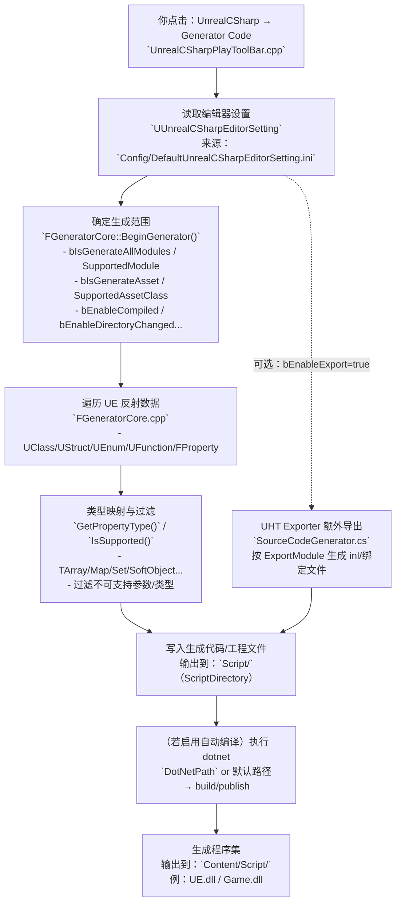
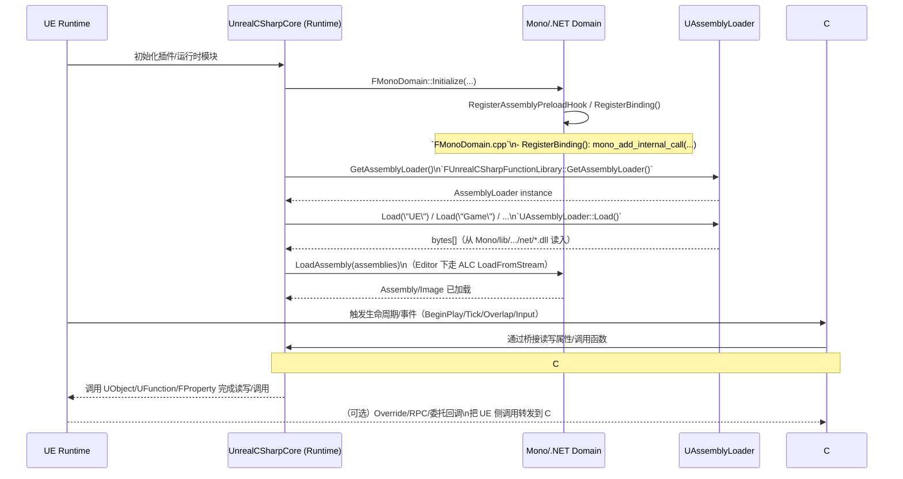

# UnrealCSharp × Unreal Engine：交互机制与新手上手指南（以本仓库为例）

> 这份文档写给：会用 UE 编辑器、能读一点 C# / C++，但第一次接触 UnrealCSharp 的同学。目标是让你知道“它到底怎么把 UE 和 C# 连起来”，以及你在这个仓库里该从哪一步开始。

## TL;DR

- UnrealCSharp 的核心思路是：**用 UE 的反射系统（UClass/UStruct/UFunction/FProperty）生成 C# 侧的“代理/封装代码”，再把你的 C# 编译成 DLL，让 UE 在运行时加载并与原生对象互相调用**。
- “生成”这件事主要发生在编辑器阶段：它会根据配置（模块/资产范围）生成 C# 代码与工程文件，并可在变更时自动重新生成/编译。
- “运行”这件事主要发生在游戏阶段：UE 插件加载 `Content/Script/` 下的程序集，通过句柄（`GarbageCollectionHandle`）把 C# 对象和 UE 的 `UObject` 绑定在一起，实现属性读写和函数调用。
- 在本仓库里，你已经能看到“C# 驱动蓝图/资产”的完整实战：从 GameMode 生成机器人、到 InteractionComponent 驱动门/风扇/平台、再到 EnhancedInput 绑定输入、以及 SaveGame/音频/UI 的联动。

## 你在这个仓库里会看到的关键路径

- UE 项目配置：`StackOBot.uproject`
- UnrealCSharp 插件（submodule）：`Plugins/UnrealCSharp/`
- UnrealCSharp 编辑器设置（本项目默认）：`Config/DefaultUnrealCSharpEditorSetting.ini`
  - 这里把脚本目录设置成 `Script`：`ScriptDirectory=(Path="Script")`
- C# 产物输出目录（默认）：`Content/Script/`
  - 你会在这里看到类似 `UE.dll`、`Game.dll` 的程序集（可再生成，通常不提交版本库）

## 一张图看懂“编辑器生成链路”和“运行时调用链路”

> 说明：下图使用 Mermaid 语法。若你的 Markdown 阅读器不渲染 Mermaid，可把内容复制到支持 Mermaid 的预览器（例如 VS Code + Mermaid 插件、或在线 Mermaid Live Editor）查看。

### 架构图（组件与目录关系）

```mermaid
flowchart LR
  %% ========== Editor Side ==========
  subgraph UEEditor["UE 编辑器（WITH_EDITOR）"]
    Settings["项目设置（Editor Setting）<br/>Config/DefaultUnrealCSharpEditorSetting.ini<br/>- ScriptDirectory=Script<br/>- SupportedModule=...<br/>- bIsGenerateAsset / bEnableCompiled / ..."]
    Toolbar["菜单/工具栏入口<br/>UnrealCSharpPlayToolBar.cpp<br/>- Generator Code<br/>- Open EditorSettings / RuntimeSettings"]
    Generator["代码生成器（C++）<br/>FGeneratorCore.cpp<br/>- BeginGenerator(): 读取设置<br/>- GetPropertyType(): 类型映射<br/>- IsSupported(): 过滤范围"]
    UHTExporter["UHT Exporter（可选导出）<br/>SourceCodeGenerator.cs<br/>- 读取 bEnableExport<br/>- Generate(): 扫模块/插件"]
  end

  subgraph ProjectFS["项目目录（本仓库）"]
    ScriptDir["脚本工作区<br/>Script/<br/>（生成的 Proxy/工具链工程常驻）"]
    ContentScript["程序集输出目录<br/>Content/Script/<br/>- UE.dll<br/>- Game.dll<br/>（可再生成，通常不提交）"]
    GameScripts["业务脚本（本仓库示例）<br/>Script/Game/Game/StackOBot/**<br/>- GM_InGame_C / BP_Bot_C / ..."]
  end

  subgraph DotNetToolchain[".NET 工具链（dotnet + 生成/织入）"]
    Roslyn["Roslyn Source Generator<br/>Script/SourceGenerator/UnrealTypeSourceGenerator.cs<br/>- 必须 partial<br/>- 文件名/类名规则"]
    Fody["Fody Weaver（IL 织入）<br/>Script/Weavers/UnrealTypeWeaver.cs<br/>- 注入注册 / GCHandle / RPC 等"]
    Build["dotnet build/publish<br/>输出到 Content/Script/"]
  end

  %% Editor flow edges
  Toolbar --> Generator
  Settings --> Generator
  Generator --> ScriptDir
  UHTExporter --> ScriptDir
  ScriptDir --> Roslyn --> Fody --> Build --> ContentScript
  GameScripts --> Build

  %% ========== Runtime Side ==========
  subgraph UERuntime["UE 运行时（Game/PIE）"]
    RuntimeModule["UnrealCSharpCore Runtime<br/>加载域/程序集/绑定<br/>FMonoDomain.cpp"]
    Loader["程序集加载器<br/>UAssemblyLoader::Load()<br/>AssemblyLoader.cpp"]
    Bridge["桥接层（internal calls）<br/>- FPropertyImplementation.*<br/>- FFunctionImplementation.*<br/>（C# 侧通过句柄调用）"]
    Overrides["C# 覆盖/事件/逻辑<br/>[Override] + 代理类<br/>例：BP_Bot_C.ReceiveTick()"]
  end

  ContentScript --> RuntimeModule
  RuntimeModule --> Loader
  Loader --> RuntimeModule
  RuntimeModule --> Bridge --> Overrides
```



### 编辑器生成流程图（生成/编译发生了什么）



### 运行时调用流程图（C# 调 UE / UE 回调 C#）



### 1) 编辑器生成链路（把 UE 的类型/资产变成 C# 可用的代码）

1. UE 编辑器加载 UnrealCSharp 插件（`Plugins/UnrealCSharp/Source/*`）。
2. 插件读取 `UUnrealCSharpEditorSetting`（对应 ini：`Config/DefaultUnrealCSharpEditorSetting.ini`）。
3. 根据设置决定要“生成哪些东西”：
   - 生成哪些模块的反射绑定：`bIsGenerateAllModules`、`SupportedModule=...`
   - 是否生成资产相关的封装：`bIsGenerateAsset`、`SupportedAssetClass=...`
4. 插件的生成器（示例入口：`Plugins/UnrealCSharp/Source/ScriptCodeGenerator/Private/FGeneratorCore.cpp`）遍历 UE 的反射数据：
   - `UClass/UStruct/UEnum/UFunction/FProperty`
   - 对每种属性类型做映射（例如数组/Map/Set/SoftObject 等），决定 C# 侧类型长什么样。
5. 生成的 C# 代码（Proxy/Wrapper）与工程文件通常放在项目脚本目录（本仓库是 `Script/`）下。

你可以把这一步理解为：**把“反射”翻译成“C# 可以编译/可以调用的 API”**。

### 2) 运行时调用链路（让 C# 调到 UE，UE 也能回调到 C#）

运行时会发生三件事：

1. UE 插件加载程序集：
   - 典型位置是 `Content/Script/`（本仓库的 C# 项目也默认输出到这里）。
2. C# 侧通过“句柄”引用 UE 对象：
   - 生成代码里经常能看到 `GarbageCollectionHandle` 之类的字段/属性；它表示“这个托管对象对应的原生对象地址/句柄”。
   - 属性读写会走类似 `FPropertyImplementation.*` 的桥接函数；函数调用会走类似 `FFunctionImplementation.*` 的桥接函数（具体名字会随生成器版本变化，但模式一致）。
3. UE 侧也可以回调到 C#：
   - 例如 RPC/事件/覆盖函数（Override）等场景，插件会把 UE 的调用转发到 C# 实现（需要生成器/运行时都支持）。

你可以把这一步理解为：**“C# 不直接‘懂’UE 内存结构，它只拿一个句柄；真正的属性访问与函数调用由插件在中间做翻译和转发。”**

## C#-First（Unity-like）模式：核心数据/逻辑都在 C#，UE 只提供引擎能力

> 你的目标是“团队统一写 C# 脚本”，因此把血量、背包、任务进度、数值规则等都放在 C# 的纯托管数据结构里；UE 侧只负责世界、渲染、动画、物理、输入、网络等引擎能力。下面这节只讲**交互细节**：C# 如何调用 UE、UE 的结果如何回到 C#、以及哪些边界容易踩坑。

### 1) C# 调 UE：两类调用（属性访问 vs 函数调用）

**A. 属性访问（读写 UE 对象上的 UPROPERTY）**

当你在 C# 里访问某个 UE 对象的属性（例如 `SomeComponent.Enabled = true`），代理代码本质会走：
- `FPropertyImplementation.FProperty_Get*Implementation(...)`
- `FPropertyImplementation.FProperty_Set*Implementation(...)`

它的核心机制是：
- C# 代理对象持有 `GarbageCollectionHandle`（指向 UE 侧对象实例）。
- 代理类里会有一个静态字段（例如 `__Health`/`__BotFaceMaterial`）作为“属性 ID/偏移的缓存”。
- Get/Set 会把值写进一块临时 buffer（常见是 `stackalloc`），由桥接层把 UE 内存里的值拷贝到 buffer，再由 C# 解释为托管类型。

本仓库可直接对照的真实例子：`Script/Game/Game/StackOBot/UI/MainMenu/MainMenu_C.cs` 的 `BotFaceMaterial` 属性 get/set。

**B. 函数调用（执行 UFunction / Blueprint Callable / K2_ 方法）**

当你在 C# 里调用 UE 方法（例如 `UGameplayStatics.GetAllActorsOfClass(...)`、`Actor.K2_SetActorLocation(...)`、`World.SpawnActor<T>(...)`），代理代码本质会走：
- `FFunctionImplementation.*`（函数名随版本不同，但模式一致）

它的核心机制是：
- C# 侧把参数按 UE 期望的内存布局写入 buffer。
- 桥接层根据“函数 ID”找到 `UFunction`，通过 `ProcessEvent` 执行。
- UE 把返回值和 `out` 参数写回同一块 buffer，C# 再解包得到结果。

你在代码层能感知到的“返回到 C#”形式通常只有三种：
- 直接返回值：`var x = Foo();`
- `out` 参数：`Foo(out var x);`
- 引用类型返回：返回的其实是一个“代理对象”，内部仍然靠 `GarbageCollectionHandle` 指向 UE 实例。

### 2) 当核心数据在 C#：推荐把 UE 对象当“外设”，不要把它们塞进数据模型

Unity-like 模式最常见的坑是：把 `UObject/AActor/UComponent` 当成数据的一部分长期持有，然后在某个时刻对象已销毁/关卡切换/PIE 结束，C# 仍然在访问它。

更稳的心智模型是：
- C# 数据模型：纯托管（POCO/record/class），可序列化/可测试/与 UE 生命周期解耦。
- UE 对象：只在“需要引擎能力的瞬间”拿来用（渲染、碰撞、动画、音效、Spawn/Destroy、UI、输入）。
- 两者之间用“ID/句柄/弱引用”连接，而不是互相强持有。

在本仓库里你能看到类似“及时解绑/及时取消”的写法来避免幽灵引用：
- `BP_Fan_C`、`BP_InteractionComponent_C` 在 `ReceiveEndPlay` 里 `TokenSource?.Cancel()`（避免 async 循环跑到对象销毁后）。
- `BP_Door_C` 在 `ReceiveEndPlay` 里 `OnInteract.RemoveAll(this)`（避免委托回调悬挂）。

### 3) UE 的结果如何“返回到 C#”：拷贝、句柄与生命周期

你需要区分两类“返回值”：

**A. 值类型/结构体（会拷贝）**

像 `FVector`、`FRotator`、`FTransform`、`FHitResult`、`FLinearColor` 这类结构体，通常是“从 UE 拷贝到 C#”：
- 你改了 C# 本地的 `FVector` 变量，不会自动改回 UE，除非你再调用 Set/函数把它写回去。
- 这类返回值很适合 C# 侧做数值运算和规则判断（血量计算、背包容量、掉落概率等）。

**B. UObject/Actor/Component（返回的是代理 + 句柄）**

像 `GetWorld()`、`GetOwner()`、`UGameplayStatics.GetPlayerPawn(...)` 返回的对象，本质是“C# 代理对象 + 指向 UE 实例的句柄”：
- UE 对象销毁后，句柄会失效；你必须在使用前做 `IsValid()`/null 检查，并在生命周期结束时解绑事件/取消任务。
- “返回给 C#”不代表“所有权转移”；C# 不负责释放 UE 对象（销毁仍应通过 UE API，如 `K2_DestroyActor()`）。

### 4) 线程与 async：C# 可以 async，但 UE API 通常要求在 Game Thread 调

UnrealCSharp 允许你在 C# 里写 `async/await`（本仓库大量使用 `Task.Delay` 做轮询/节流）。

关键边界是：
- `Task.Delay` 之后的继续执行可能不在 UE 的游戏线程；而很多 UE API 只能在 Game Thread 调用。
- 因此“Unity-like 纯 C# 逻辑”可以在后台跑（纯计算/背包整理/AI 决策），但一旦要触碰 UE 对象（Spawn、Destroy、SetActorLocation、PlaySound、读写 UPROPERTY）就要确保回到合适线程。

本仓库的 async 示例都把 UE 调用限制在“已知仍安全的上下文里”，并通过 `CancellationToken` 做收尾；如果你要把更多核心逻辑 async 化，务必把“触碰 UE”集中到主线程安全的入口（Tick/事件回调/定时器回调）。

### 5) “血量/背包”等数据在 C# 时，UE 通常扮演的角色

在 C#-first 设计里，UE 往往只做这几类事（C# 调它、拿返回值/结果回 C#）：
- **世界查询**：射线、重叠、导航、查找 Actor（例：`UGameplayStatics.GetAllActorsOfClass`，返回 `TArray<AActor>`）。
- **表现层**：动画、粒子、材质参数、音效（例：`UKismetMaterialLibrary.SetVectorParameterValue`、`CreateSound2D`）。
- **实体生命周期**：Spawn/Destroy、组件启停（例：`World.SpawnActor<T>`、`K2_DestroyActor`、`SetComponentTickEnabled`）。
- **输入/事件**：EnhancedInput 触发后把输入值传给 C# 规则层（本仓库是 Controller→Pawn 转发）。
- **存档/读档**：通过 `UGameplayStatics.SaveGameToSlot` 这种 UE API 落盘，但保存的“内容来源”可以完全由 C# 数据序列化得来。

如果你按这个思路理解，“UE 处理 → 返回到 C#”就会非常直观：
- 返回值/`out` 参数：来自 `FFunctionImplementation.*` 的 buffer 解包。
- 引用对象：来自 `GarbageCollectionHandle` 指向的 UE 实例（需要 `IsValid` + 生命周期收尾）。

## 从项目看：C# × UE 的 13 个典型场景（带真实代码）

下面的例子全部来自本仓库 `Script/Game/Game/StackOBot/**`，你可以直接打开对应文件对照阅读。

### 1) 覆盖蓝图生命周期：`ReceiveBeginPlay/ReceiveTick/ReceiveEndPlay`

**场景**：`BP_Bot_C` 在 Tick 中更新相机/喷气背包，并把角色位置写进材质参数集合（环境草丛响应）。

文件：`Script/Game/Game/StackOBot/Blueprints/Character/BP_Bot_C.cs`

```csharp
[Override]
public override void ReceiveTick(float DeltaSeconds)
{
    if (!IsInactive)
    {
        UpdateCamera();
        UpdateJetpack();

        UKismetMaterialLibrary.SetVectorParameterValue(
            this,
            Unreal.LoadObject<UMaterialParameterCollection>(this,
                "/Game/StackOBot/Environment/Materials/MPC_DataSet.MPC_DataSet"),
            "PlayerPosition",
            UKismetMathLibrary.Conv_VectorToLinearColor(K2_GetActorLocation())
        );
    }
}
```

你要记住的点：
- `[Override]` 表示这是“覆盖 UE/蓝图里可覆盖的事件/函数”的一种机制（插件会做桥接）。
- Tick 里写逻辑要克制；这个例子也在注释里提醒了性能风险。

### 2) “工具类/函数库”：纯静态调用（Blueprint Function Library）

**场景**：`BPFL_InGame_C.GetMaxBots()` 是一个“纯函数”，GameMode 和 Bot 都能直接调用。

文件：`Script/Game/Game/StackOBot/Blueprints/Framework/BPFL_InGame_C.cs`

```csharp
public static int GetMaxBots()
{
    return 8;
}
```

### 3) 找场景里某类 Actor：`UGameplayStatics.GetAllActorsOfClass`

**场景**：`GM_InGame_C` 启动时找 `BP_SpawnPad_C` 作为出生点；找不到就降级选第一个。

文件：`Script/Game/Game/StackOBot/Blueprints/Framework/GM_InGame_C.cs`

```csharp
var outActors = new TArray<AActor>();
UGameplayStatics.GetAllActorsOfClass(this, BP_SpawnPad_C.StaticClass(), ref outActors);

foreach (var actor in outActors)
{
    var pad = actor as BP_SpawnPad_C;
    if (pad.IsStartSpawnPad)
        ActiveSpawnPad = pad;
}
```

这里体现了两件“C# 调 UE”的基础能力：
- `StaticClass()`：把 UE 的 `UClass` 引到 C#（用于反射/Spawn/查找）。
- `TArray<>`：UE 容器在 C# 侧的映射（不是 `List<>`）。

### 4) Spawn：在运行时生成 Actor，并调用它的 C# 方法

**场景**：`GM_InGame_C` 可以生成一批机器人，并给每个机器人设置索引（决定颜色）。

文件：`Script/Game/Game/StackOBot/Blueprints/Framework/GM_InGame_C.cs`

```csharp
var world = GetWorld();
if (world == null) return;

var transform = new FTransform(location);
var bot = world.SpawnActor<BP_Bot_C>(transform, new FActorSpawnParameters
{
    SpawnCollisionHandlingOverride =
        ESpawnActorCollisionHandlingMethod.AdjustIfPossibleButAlwaysSpawn
});

bot?.SetBotIdx(i);
```

注意：
- 这里的 `SetBotIdx` 是 `BP_Bot_C` 里用 C# 写的普通方法，最终仍然在 UE 的 Actor 生命周期中执行。

### 5) 组件与事件：用交互组件驱动“门”的开关（委托 Add/RemoveAll）

**场景**：门可以绑定多个触发器（按钮/压力板）。触发器通过 `BP_InteractionComponent_C` 发出 `OnInteract` 事件。

文件：`Script/Game/Game/StackOBot/Blueprints/GameElements/BP_Door_C.cs`

```csharp
var component = Trigger.GetComponentByClass(BP_InteractionComponent_C.StaticClass())
                 as BP_InteractionComponent_C;

component?.OnInteract.Add(this, OnInteract);
```

退出时解绑（避免悬挂回调）：

```csharp
component?.OnInteract.RemoveAll(this);
```

这个模式非常重要：
- UE 的委托/事件在 C# 侧通常表现为 `Add/RemoveAll/Remove` 等 API。
- 只要你订阅了事件，就要在 EndPlay/销毁时解绑（否则可能导致对象已销毁但仍被回调）。

### 6) 组件事件：Overlap 触发 + 异步循环（CancellationToken 防止“幽灵循环”）

**场景**：风扇区域 Overlap 时开始“持续推力”；离开 Overlap 或 EndPlay 时停止。

文件：`Script/Game/Game/StackOBot/Blueprints/GameElements/BP_Fan_C.cs`

开始/结束 Overlap：

```csharp
FanArea.OnComponentBeginOverlap.Add(this, OnComponentBeginOverlap);
FanArea.OnComponentEndOverlap.Add(this, OnComponentEndOverlap);
```

循环推力（核心是“可取消”）：

```csharp
TokenSource?.Cancel();
TokenSource = new CancellationTokenSource();
UpdateForce();

// ...
while (!TokenSource.IsCancellationRequested)
{
    var player = UGameplayStatics.GetPlayerCharacter(this, 0);
    if (!player.IsOverlappingActor(this))
    {
        TokenSource.Cancel();
        break;
    }
    player.LaunchCharacter(launchVelocity, false, true);
    await Task.Delay(10);
}
```

为什么要这样写：
- UE 的生命周期不是 .NET 的 GC 语义：Actor 可能 EndPlay，但你的 `async` 仍然在跑。
- 取消令牌是最简单、最可靠的“收尾开关”。

### 7) Enhanced Input：在 PlayerController 里绑定输入，并在 EndPlay 移除

**场景**：`PC_InGame_C` 绑定一组 `InputAction`，触发时转发给 `BP_Bot_C`。

文件：`Script/Game/Game/StackOBot/Blueprints/Framework/PC_InGame_C.cs`

绑定（`BindAction` 返回一个 binding 句柄，后面移除要用）：

```csharp
var eic = InputComponent as UEnhancedInputComponent;
MoveForward_Triggered =
    eic.BindAction<IA_MoveForward>(ETriggerEvent.Triggered, this, IA_MoveForward_Triggered);
```

转发给 Pawn（Controller 做“脑”，Pawn 做“手脚”）：

```csharp
(Pawn as BP_Bot_C)?.IA_MoveForward_Triggered(ActionValue, ElapsedTime, TriggeredTime, SourceAction);
```

EndPlay 里移除：

```csharp
eic.RemoveAction(this, MoveForward_Triggered, IA_MoveForward_Triggered);
```

你可以把它理解成：**委托绑定 + 生命周期解绑** 的输入版本。

### 8) SaveGame：保存“轻数据”（数量/Transform/Class）而不是 Actor 引用

**场景**：GameInstance 保存“收集到的能量球数量”，以及“地图上剩余可收集物”的 class+transform 列表。

文件：`Script/Game/Game/StackOBot/Blueprints/Framework/GI_StackOBot_C.cs`

保存数量：

```csharp
PlayerInventorySaveGame.Orbs = CollectedOrbs;
UGameplayStatics.SaveGameToSlot(PlayerInventorySaveGame, SaveGameSlotName, 0);
```

保存“可收集物”列表（只存 class+transform）：

```csharp
LevelSaveObject.AddCollectable(new CollectableObjectData
{
    ActorClass = OutActor.GetClass(),
    Transform = OutActor.GetTransform()
});
```

恢复时按 class+transform 重建（避免引用失效）：

```csharp
GetWorld().SpawnActor<AActor>(CollectablePickup.ActorClass, CollectablePickup.Transform);
```

### 9) 底层桥接长什么样：`PathName` + `StaticClass` + `FPropertyImplementation`

**场景**：主菜单关卡脚本 `MainMenu_C` 里，`BotFaceMaterial` 这个属性的 get/set 走的是“句柄 + FPropertyImplementation”。

文件：`Script/Game/Game/StackOBot/UI/MainMenu/MainMenu_C.cs`

类级别：用 `PathName` 把 C# 类绑定到具体资产（这里是 Level Blueprint）：

```csharp
[PathName("/Game/StackOBot/UI/MainMenu/MainMenu.MainMenu_C")]
public partial class MainMenu_C : ALevelScriptActor, IStaticClass
{
    public new static UClass StaticClass()
    {
        return UObjectImplementation.UObject_StaticClassImplementation(
            "/Game/StackOBot/UI/MainMenu/MainMenu.MainMenu_C");
    }
}
```

属性级别：通过 `GarbageCollectionHandle` 读写原生属性：

```csharp
FPropertyImplementation.FProperty_GetObjectPropertyImplementation(
    GarbageCollectionHandle, __BotFaceMaterial, __ReturnBuffer);

FPropertyImplementation.FProperty_SetObjectPropertyImplementation(
    GarbageCollectionHandle, __BotFaceMaterial, __InBuffer);
```

新手只需要掌握结论：
- 你写 `BotFaceMaterial = xxx`，底层其实是在“用句柄找到原生对象的属性并写进去”。
- 这就是 UnrealCSharp 能让你像写 C# 属性一样操作 UE 对象的原因。

### 10) 资源加载 + 2D 音频：`Unreal.LoadObject` + `UGameplayStatics.CreateSound2D`

**场景**：GameInstance 在需要时创建并播放一段“跨关卡持续播放”的音乐（MetaSound）。

文件：`Script/Game/Game/StackOBot/Blueprints/Framework/GI_StackOBot_C.cs`

```csharp
if (Music == null || !Music.IsValid())
{
    var sound = Unreal.LoadObject<UMetaSoundSource>(
        this, "/Game/StackOBot/Audio/SFX_Music.SFX_Music");

    Music = UGameplayStatics.CreateSound2D(
        this, sound, (float)Volume, 1.0f, 0.0f, null, true);
}

if (!Music.IsPlaying())
{
    Music.Play();
}
```

你可以把它当作“C# 版蓝图节点链”：加载资产（软路径）→ 创建音频组件 → 播放。

### 11) Control Rig 事件：`OnPreForwardsSolveDelegate / OnPostForwardsSolveDelegate`

**场景**：移动平台用 ControlRig 做 verlet 模拟，C# 侧在 pre/post 回调里喂数据/取结果。

文件：`Script/Game/Game/StackOBot/Blueprints/GameElements/BP_MovingPlatform_C.cs`

绑定与解绑（依然是生命周期对称）：

```csharp
ControlRig.OnPreForwardsSolveDelegate.Add(this, OnPreForwardsSolve);
ControlRig.OnPostForwardsSolveDelegate.Add(this, OnPostForwardsSolve);

// EndPlay:
ControlRig.OnPreForwardsSolveDelegate.RemoveAll(this);
ControlRig.OnPostForwardsSolveDelegate.RemoveAll(this);
```

pre/post 回调（把 Actor Transform 送进 rig，再把 rig 输出应用到 mesh）：

```csharp
private void OnPreForwardsSolve(UControlRigComponent component)
{
    component.SetBoneTransform("Anchor", GetTransform());
}

private void OnPostForwardsSolve(UControlRigComponent component)
{
    var bone = component.GetBoneTransform("Platform");
    var sweep = new FHitResult();
    PlatformMesh.K2_SetWorldLocationAndRotation(
        bone.GetLocation(),
        bone.GetRotation().Rotator(),
        true,
        ref sweep,
        false);
}
```

这类回调的意义：你在 C# 里依然能接入“引擎/组件的事件流”，并把结果反馈回场景。

### 12) 交互组件的“朝向检测”：Dot Product + `async` 轮询

**场景**：`BP_InteractionComponent_C` 用点积判断玩家是否面向交互物体，从而启用/禁用交互。

文件：`Script/Game/Game/StackOBot/Blueprints/Abilities/BP_InteractionComponent_C.cs`

```csharp
while (!TokenSource.IsCancellationRequested)
{
    if ((UGameplayStatics.GetPlayerPawn(this, 0).GetActorForwardVector() |
         GetOwner().GetActorForwardVector()) <= -0.5f)
    {
        EnableInteractability();
    }
    else
    {
        DisableInteractability();
    }

    await Task.Delay(10);
}
```

“|” 在这里不是按位或，而是向量点积运算符重载（从而得到一个 -1..1 的相似度）。

### 13) Enhanced Input 的“另一半”：Pawn 被 Possess 时添加 Mapping Context

**场景**：`BP_Bot_C` 在 `ReceivePossessed` 时把 `IM_ThirdPersonControls` 加到本地玩家子系统里。

文件：`Script/Game/Game/StackOBot/Blueprints/Character/BP_Bot_C.cs`

```csharp
var pc = NewController as APlayerController;
var subsystem =
    USubsystemBlueprintLibrary.GetLocalPlayerSubSystemFromPlayerController(
        pc, UEnhancedInputLocalPlayerSubsystem.StaticClass())
    as UEnhancedInputLocalPlayerSubsystem;

subsystem?.AddMappingContext(
    Unreal.LoadObject<UInputMappingContext>(this,
        "/Game/StackOBot/Input/IM_ThirdPersonControls.IM_ThirdPersonControls"),
    0);
```

把它和“第 7 点 Controller 绑定 Action”连起来看，就能理解完整输入链：
- Pawn 被 Possess → 安装 Mapping Context
- Controller BindAction → 把输入事件路由到 Pawn 的实现

## UnrealCSharp 的“交互能力”来自哪三块

### A. 反射绑定（静态生成：把 UE 类型映射到 C#）

核心输入：UE 反射系统（`UClass/UStruct/UFunction/FProperty`）。

核心输出：C# 代理代码（让你在 C# 里能写出类似 `UObject`、`UClass`、`TArray<>` 等操作）。

在本仓库里，你能直接看到生成器如何判断“支持哪些类型/参数”：
- `Plugins/UnrealCSharp/Source/ScriptCodeGenerator/Private/FGeneratorCore.cpp`
  - `IsSupported(...)` 系列函数会过滤“这个类/函数/属性能不能生成”
  - `GetPropertyType(...)` 会把 UE 的属性类型映射成目标语言的类型表达

### B. 托管代码生成 + IL 织入（动态类：让 C# 也能“像 UE 那样”声明 UClass/UStruct）

UnrealCSharp 支持“动态类”能力：用 C# 代码声明 UClass/UStruct/UEnum/UInterface，并参与运行时交互。

这条链路一般会包含两步：

1) **Roslyn Source Generator（编译期生成）**

- 在本仓库里可以看到一个示例生成器：`Script/SourceGenerator/UnrealTypeSourceGenerator.cs`
- 它会做一些“规则约束”和“补代码”的事情，例如：
  - 你的动态类必须是 `partial`
  - 文件名与类名必须匹配（避免反射/生成时定位错误）

2) **Fody Weaver（编译后织入 IL）**

- 在本仓库里可以看到一个示例织入器：`Script/Weavers/UnrealTypeWeaver.cs`
- 它会在编译后的程序集里注入必要的逻辑，例如：
  - 自动注册/注销 `UStruct`
  - 处理 `GarbageCollectionHandle`、必要的桥接方法
  - 处理 RPC 方法（如 Server/Client/NetMulticast 等标记）

新手理解成一句话就够了：**动态类不是“纯 C#”，它需要编译期与编译后两道工序，把必要的 UE 交互代码塞进你的程序集里。**

### C. 编辑器集成（让“生成/编译/更新”变得可点可用）

在本仓库的 UnrealCSharp 版本里，编辑器工具栏里会出现一个 UnrealCSharp 菜单：
- 代码位置：`Plugins/UnrealCSharp/Source/UnrealCSharpEditor/Private/ToolBar/UnrealCSharpPlayToolBar.cpp`
- 菜单项包括：
  - `Generator Code`：触发生成/更新（具体行为取决于插件实现与当前设置）
  - `Open NewDynamicClass`：创建/管理动态类入口
  - `Open EditorSettings`：打开编辑器侧设置（对应 `UUnrealCSharpEditorSetting`）
  - `Open RuntimeSettings`：打开运行时侧设置（对应 `UUnrealCSharpSetting`）

## 新手上手：在这个仓库里怎么开始（推荐路径）

### 1) 确认配置：脚本目录与生成范围

先读一遍：`Config/DefaultUnrealCSharpEditorSetting.ini`

重点关注：
- `DotNetPath=`：为空时插件会走默认值（Windows 默认 `C:/Program Files/dotnet/dotnet.exe`），如果你的 dotnet 不在默认路径，需要填写。
- `ScriptDirectory=(Path="Script")`：表示项目脚本工作区在 `Script/`。
- `bIsGenerateAllModules=True` + `SupportedModule=...`：决定要不要全量生成模块（全量会更慢，但新手不容易漏类型）。
- `bIsGenerateAsset=True` + `SupportedAssetClass=...`：决定要不要为蓝图等资产生成封装。

### 2) 在 UE 编辑器里生成一次

打开项目后：

1. 在工具栏找到 `UnrealCSharp` 菜单（通常在 Play 工具栏区域）。
2. 点击 `Generator Code`。

第一次生成的目的不是“写业务”，而是确认这几件事都跑通：
- 生成器能读到项目设置
- 能在 `Script/` 下写入生成代码/工程文件
- 能编译出程序集到 `Content/Script/`（如果你开启了自动编译）

### 3) 写你的 C# 代码：不要改“生成文件”，用 `partial` 扩展

生成出来的 Proxy/Wrapper 代码可能会被重复生成覆盖。

更稳的做法是：
- 不修改生成的 `.cs` 文件
- 新建一个你自己的 `.cs` 文件，写同名同命名空间的 `partial class` 来扩展逻辑

这样你的手写代码就不会被下一次 `Generator Code` 覆盖掉。

举个“本项目风格”的例子（建议你自己新建文件，不要直接改生成文件）：

```csharp
// 放到：Script/Game/Game/StackOBot/Blueprints/Character/BP_Bot_C.Extra.cs
namespace Script.Game.StackOBot.Blueprints.Character
{
    public partial class BP_Bot_C
    {
        public void DebugTeleportTo(FVector location)
        {
            var sweep = new FHitResult();
            K2_SetActorLocation(location, false, ref sweep, false);
        }
    }
}
```

这个例子对应的交互机制是：
- 你扩展了同一个 `partial class`，所以它能直接访问生成代码里已经存在的 UE API（例如 `K2_SetActorLocation`）。
- 下一次生成 Proxy 时不会覆盖你的 `*.Extra.cs`。

### 4) 验证“C# 已被加载”

最简单的验证方式通常是：
- 观察 UE 日志是否出现 UnrealCSharp 相关的加载/编译日志
- 确认 `Content/Script/` 下存在 `UE.dll`、`Game.dll` 等输出

如果你需要更精确的验证口径，建议结合插件的 RuntimeSettings/日志选项来打开更详细的日志（具体项随版本变化）。

## 常见问题（快速定位）

### 生成出来的类型缺很多 / 找不到某个类

优先检查：
- `Config/DefaultUnrealCSharpEditorSetting.ini` 里的 `bIsGenerateAllModules` 与 `SupportedModule`
- 资产是否在支持范围：`bIsGenerateAsset`、`SupportedAssetClass`、`SupportedAssetPath`

### dotnet 找不到 / 编译失败

优先检查：
- `DotNetPath` 是否需要填写
- 你的 dotnet SDK 版本是否满足插件要求（UnrealCSharp 文档声明基于 .NET 8）

### 我改了 C# 代码但 UE 没反应

优先检查：
- `bEnableCompiled`、`bEnableDirectoryChanged` 是否开启
- 是否需要手动触发一次 `Generator Code`

## 版本控制建议（避免提交无意义生成物）

本仓库已经在 `.gitignore` 中忽略了大多数可再生成的目录（例如 `Content/Script/`、`Script/**/bin/obj` 等）。

如果你发现还有大量“未跟踪文件”出现在源码管理里：
- 先判断它是不是可再生成（通常是）
- 再补充 `.gitignore`（不要把真正的资产/源码误忽略）
