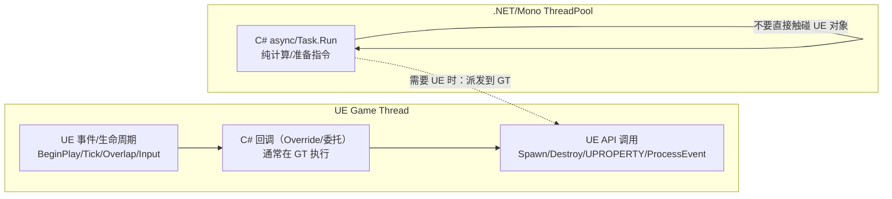

# UnrealCSharp × UE5：运行时线程模型与线程边界（C#-First 团队必读）

这份文档回答两个问题：

1) 项目运行时，UE5 的线程模型大致是什么样的？  
2) UnrealCSharp 把 C#（Mono/.NET）嵌进 UE 后，C# 代码会在哪些线程上跑？哪些调用必须回到 Game Thread？

## TL;DR（先记住这几句）

- **绝大多数 UE `UObject/AActor/UActorComponent` 的访问与 `ProcessEvent` 调用，默认要求在 Game Thread。**
- UnrealCSharp 的 C# 运行时在同一进程内：**C# 代码既可能在 Game Thread 上被 UE 回调执行，也可能在 .NET/Mono 的线程池线程上执行（例如 `Task.Run` / `async` 继续执行）。**
- 插件里有些桥接会显式 `AsyncTask(ENamedThreads::GameThread, ...)`，但**不是所有桥接都会自动切回 Game Thread**。
- 团队统一写 C# 时，最佳实践是：**把纯计算放后台线程，把“触碰 UE 对象”的部分集中到 Game Thread 入口**（Tick/事件回调/定时器/显式派发）。

---

## 1) UE5 运行时线程模型（你写玩法脚本时默认面对的）

不同平台/配置会影响细节，但 UE5 常见的线程/执行域包括：

- **Game Thread**：世界更新、Actor 生命周期（BeginPlay/Tick/EndPlay）、蓝图事件/函数（`ProcessEvent`）、大多数 `UObject` 读写与创建/销毁都在这条线程上发生。
- **Render Thread / RHI Thread**：渲染命令与图形 API；不要在这里直接操作大多数 `UObject`。
- **TaskGraph Worker Threads**：UE 的任务图系统用来并行执行工作（动画、物理、资源处理等可能通过任务图并行化）。
- **Async Loading**：异步加载相关（线程/任务形态随配置变化）。
- **Audio Render Thread**：音频渲染与混音。

结论：**脚本层玩法逻辑默认把“线程安全边界”放在 Game Thread**；跨线程需要显式规划。

---

## 2) UnrealCSharp 的运行时：C# 线程来自哪里？

UnrealCSharp 是把 Mono/.NET 嵌入 UE 进程，运行时会初始化域并注册 internal call（C# → C++）桥接：

- 域初始化与 internal call 注册：`Plugins/UnrealCSharp/Source/UnrealCSharpCore/Private/Domain/FMonoDomain.cpp`
  - `FMonoDomain::Initialize(...)`
  - `RegisterBinding()` 中 `mono_add_internal_call(...)`

因此 C# 代码的执行来源一般分两类：

### A) “UE 触发 → C# 回调”：通常在 Game Thread

当 UE 触发生命周期/事件（BeginPlay/Tick/Overlap/Input/委托回调/Override），UnrealCSharp 把调用转发到 C#，这类路径通常天然发生在 Game Thread。

本仓库中可以看到插件在关键路径上明确要求 Game Thread：

- `Plugins/UnrealCSharp/Source/UnrealCSharp/Private/Registry/FClassRegistry.cpp`
  - `FClassRegistry::ClassConstructor(...)` 内部 `if (IsInGameThread()) { ... FDomain::Object_Constructor(...) }`

这说明：至少“对象构造/绑定”这种关键步骤是**有 Game Thread 假设**的。

### B) “C# 自己启动的并发”：.NET/Mono 线程池 + GC/Finalizer 等后台线程

一旦 C# 代码使用：
- `Task.Run(...)`
- `async/await`（没有 UE 同步上下文时，继续执行往往回到 ThreadPool）
- 线程/定时器/并发集合

后续逻辑就可能跑在 **.NET ThreadPool** 或 **Mono 内部线程（GC/Finalizer/Runtime）** 上。

关键结论：**internal call 会在哪条线程上执行，取决于你在哪条线程上发起调用。**

---

## 3) “会不会自动切回 Game Thread？”——答案：有些会，但不能指望全部

插件内部确实存在“把某些操作派发到 Game Thread”的实现。例如容器解绑：

- `Plugins/UnrealCSharp/Source/UnrealCSharp/Private/Domain/InternalCall/FRegisterArray.cpp`
  - `UnRegisterImplementation(...)` 内部：
    - `AsyncTask(ENamedThreads::GameThread, [...]{ RemoveContainerReference(...); })`

但这只能证明：**某些敏感操作被作者显式保护**。对于你自己调用的 UE API（比如 `K2_SetActorLocation`、`SpawnActor`、读写组件属性等），是否自动切线程，取决于对应桥接实现；不要假设“都会帮你回主线程”。

---

## 4) C#-First 团队的线程边界规则（建议写进团队规范）

把下面规则当成“Unity-like C# 脚本在 UE 中的安全基线”：

### 4.1 允许在后台线程做的事

- 纯计算：伤害结算、背包整理、AI 决策、寻路权重计算（不触碰 UE 对象）。
- 纯数据：序列化/反序列化、网络消息编码、日志分析（不触碰 UE 对象）。
- 可并行的预处理：比如为下一帧准备一份“要在主线程执行的指令列表”。

### 4.2 必须在 Game Thread 做的事（默认都当成必须）

- 创建/销毁/修改 `UObject`：`SpawnActor`、`K2_DestroyActor`、组件 Attach/Detach、设置材质、改变 Transform、读写 `UPROPERTY` 等。
- 触发蓝图事件/`UFunction`：绝大多数 `K2_` 方法、`UGameplayStatics.*` 与引擎/插件对象方法。
- 绑定/解绑委托：尤其是和世界对象生命周期绑定的事件（Overlap、Input、Timeline 更新等）。

### 4.3 你在 C# 里写了 `async`，需要额外注意两件事

1) `await Task.Delay(...)` 之后的继续执行**不保证在 Game Thread**。  
2) 只要 async 循环里触碰 UE 对象，就要把它当成“需要回 Game Thread 的区域”。

本仓库里多处 `async` 轮询都配合 `CancellationTokenSource`，这是为了避免对象 EndPlay 后“幽灵循环”继续访问 UE 对象：
- `Script/Game/Game/StackOBot/Blueprints/GameElements/BP_Fan_C.cs`：EndPlay 里 `TokenSource?.Cancel()`
- `Script/Game/Game/StackOBot/Blueprints/Abilities/BP_InteractionComponent_C.cs`：EndPlay 里 `TokenSource?.Cancel()`

---

## 5) 插件自身的线程使用（你看到的现象怎么解释）

### 5.1 编辑器侧：编译/生成通常在后台线程，但 UI/通知回到 Game Thread

UnrealCSharp 的编译 runnable 自己就是一个后台线程（FRunnable），但会把 UI 通知与某些关键逻辑派发到 Game Thread：

- `Plugins/UnrealCSharp/Source/Compiler/Private/FCSharpCompilerRunnable.cpp`
  - `FCSharpCompilerRunnable::Run()`：后台线程循环取任务
  - `Compile(...)` 内部：
    - `FFunctionGraphTask::CreateAndDispatchWhenReady(..., ENamedThreads::GameThread)`
    - `AsyncTask(ENamedThreads::GameThread, ...)`（编辑器通知/UI）

这也是 UE 常见模式：**工作线程做重活，Game Thread 负责世界/对象/界面**。

### 5.2 运行时：C# “看起来像 Unity”不代表“线程就像 Unity”

Unity 的主线程模型更“强约束”，而 UE 的生态更强调多线程/任务图。  
在 UnrealCSharp 下，你能写 C# 并不意味着 C# 就天然拥有一个“UE 同步上下文”；因此你要把“线程边界”当成显式工程问题。

---

## 6) 一张图：线程与调用路径（示意）

---

## 7) 快速自检清单（团队统一写 C# 时很实用）

- 我这段代码是否可能跑在 ThreadPool？（`Task.Run`/`await`/定时器/并发回调）
- 我是否在这段代码里触碰了 `UObject/AActor/UComponent`？（如果是：默认要求 GT）
- 我是否在 EndPlay/销毁时解绑了委托、取消了 async 循环？（`RemoveAll` / `Cancel`）
- 我是否把“纯计算”与“UE 操作”分层？（计算可并行，UE 操作集中在 GT）

